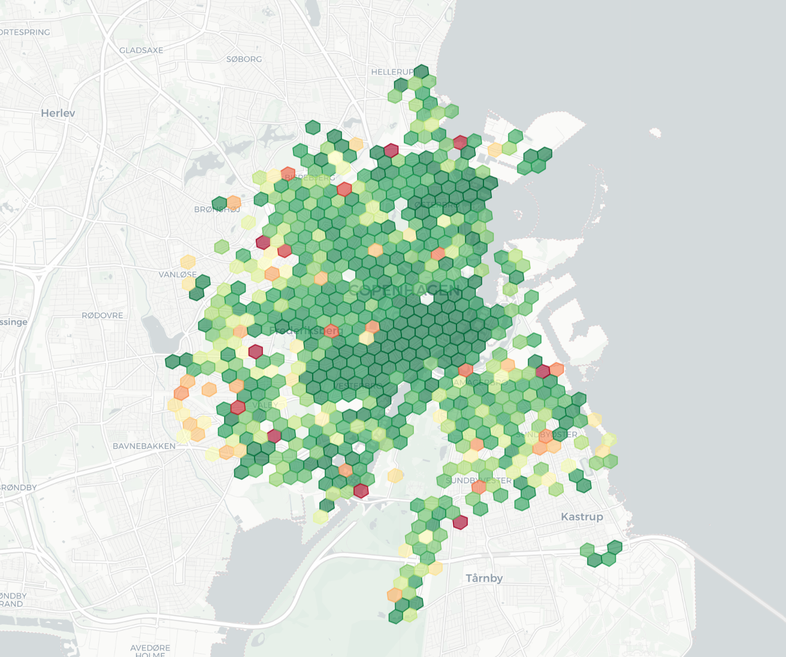
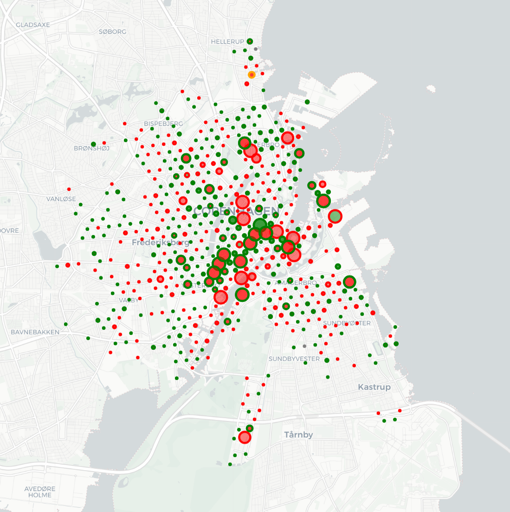

# I do stuff with data🚀

<!---

vatojavier/vatojavier is a ✨ special ✨ repository because its `README.md` (this file) appears on your GitHub profile.
You can click the Preview link to take a look at your changes.
--->
